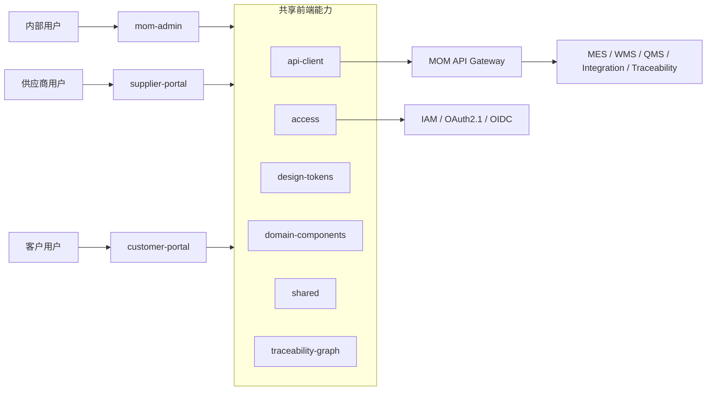

<div align="center">

# MOM Web

### 工业 MOM 管理端、供应商门户与客户门户

以 Vue 3、Vite、TypeScript 和 Ant Design Vue 构建面向新能源材料制造的多应用前端平台，并将用户流程、页面状态、原型图、组件映射与 API 契约作为正式设计资产。

<p>
  <a href="https://github.com/Chris-co-shi/mom-web/actions/workflows/ci.yml">
    
  </a>
  
  
  
  
  
</p>

[文档中心](docs/README.md) · [前端总体架构](docs/architecture/前端总体架构.md) · [V1 页面路线图](docs/plans/V1页面路线图.md) · [原型交付规范](docs/prototypes/README.md) · [ADR](docs/adr/README.md)

</div>

---

> [!IMPORTANT]
> 当前仓库处于 **V1 Web 技术骨架与设计准备阶段**。三套应用可以独立启动和构建，但正式业务路由、OAuth 登录、完整 API 接入、页面原型和领域组件仍需按垂直切片逐步实现。

> [!NOTE]
> 本仓库所有文档新增、修改、重命名和整理统一在 `agent/complete-chinese-docs` 分支进行，再通过 PR 合并到 `main`。

## 🌟 项目定位

`mom-web` 不是单一管理后台，而是 MOM 项目的浏览器端应用与交互设计中心，负责：

- 内部 MOM 运营工作台。
- 供应商送货与协同门户。
- 客户订单、发运、质量文件和客诉门户。
- Web 用户流程、页面状态矩阵和原型图。
- Gateway API 客户端、权限契约和错误处理。
- 工业领域组件、设计 Token 与批次谱系图。
- 三应用统一但可独立演进的前端工程体系。

### V1 业务体验链路

```text
供应商门户创建送货
        ↓
MOM 管理端处理来料检验与收货
        ↓
生产计划 / 执行 / 质量放行
        ↓
仓储入库与客户发运
        ↓
客户门户查询订单、COA、发运和客诉
        ↓
MOM 管理端进行正反向批次追溯与模拟召回
```

## 🧭 前端全景



## 🖥️ 三套应用

| 应用 | 用户 | V1 职责 | 默认端口 |
|---|---|---|---:|
| `apps/mom-admin` | 计划、生产、仓库、质量、设备、集成和管理人员 | MOM 内部运营工作台、业务处理、追溯与监控 | 5555 |
| `apps/supplier-portal` | 供应商业务人员 | 送货、预约、单据、质量协同和状态查询 | 5556 |
| `apps/customer-portal` | 客户业务与质量人员 | 订单、发运、COA、客诉与处理进度 | 5557 |

三套应用：

- 独立路由。
- 独立构建产物。
- 独立 OAuth Client。
- 可独立发布。
- 共享工程能力和领域组件。

## 🧩 共享包

| 包 | 职责 | 禁止事项 |
|---|---|---|
| `@mom/api-client` | Gateway HTTP 客户端、关联 ID、统一错误与请求策略 | 不保存业务状态，不暴露内部服务地址 |
| `@mom/access` | 路由、角色、权限、数据范围和登录状态契约 | 不把前端判断当作服务端授权依据 |
| `@mom/design-tokens` | 色彩、间距、字体、状态和工业界面 Token | 不包含业务流程或 API 调用 |
| `@mom/domain-components` | 批次、库存、工单、检验、设备状态等领域组件 | 不直接依赖持久化 Entity |
| `@mom/shared` | 通用类型、格式化、校验与无业务工具 | 不演变为无法治理的万能包 |
| `@mom/traceability-graph` | 批次谱系可视化边界 | 不自行推导权威谱系事实 |

## 🛠️ 技术基线

| 层次 | 技术选型 |
|---|---|
| Node.js | `22.18+` 或 `24`，CI 使用 Node 24 |
| 包管理 | pnpm `11.7.0` |
| Web 框架 | Vue 3 |
| 构建工具 | Vite `8.0.10` |
| 类型系统 | TypeScript `6.0.3` |
| 状态管理 | Pinia |
| UI 基础 | Ant Design Vue |
| 管理端参考 | Vue Vben Admin `v5.7.0`，仅作为架构与能力参考 |
| 请求边界 | Axios / Gateway-only API access |
| 工程校验 | 自定义边界校验、vue-tsc、Vite Build、GitHub Actions |

> 精确版本以根目录 `package.json`、`pnpm-lock.yaml` 和 Workspace Catalog 为唯一权威来源。

## 🏗️ 仓库结构

```text
mom-web/
├── apps/
│   ├── mom-admin/
│   ├── supplier-portal/
│   └── customer-portal/
├── packages/
│   ├── access/
│   ├── api-client/
│   ├── design-tokens/
│   ├── domain-components/
│   ├── shared/
│   └── traceability-graph/
├── docs/
│   ├── requirements/
│   ├── plans/
│   ├── architecture/
│   ├── user-flows/
│   ├── prototypes/
│   ├── page-state-matrix/
│   ├── component-mapping/
│   ├── api-mapping/
│   ├── testing/
│   ├── release/
│   └── adr/
├── scripts/
├── pnpm-workspace.yaml
├── pnpm-lock.yaml
└── package.json
```

## 🎨 原型先行交付流程

任何业务页面进入代码实现前，必须完成：

```text
业务目标
→ 用户角色与权限
→ 用户流程
→ 页面清单
→ 页面状态矩阵
→ Web 原型图
→ 组件映射
→ API / 权限 / 数据范围映射
→ 实现
→ UI 验收与回归
```

必须覆盖的页面状态包括：

- 初始化与加载。
- 空数据。
- 无权限。
- 网络失败。
- 业务失败。
- 重复提交。
- 数据已变化或版本冲突。
- 异步处理中。
- 超时与恢复。
- 人工接管或重试。

## 🚀 快速开始

### 环境要求

- Node.js 24，或满足 `^22.18.0 || ^24.0.0`
- Corepack
- pnpm 11.7.0

### 安装依赖

```bash
corepack enable
pnpm install --frozen-lockfile
```

### 启动应用

```bash
pnpm dev:admin
pnpm dev:supplier
pnpm dev:customer
```

### 质量检查

```bash
pnpm validate
pnpm check:type
pnpm build
```

或者执行组合检查：

```bash
pnpm check
```

## 📚 文档导航

| 分类 | 入口 | 说明 |
|---|---|---|
| 总览 | [文档中心](docs/README.md) | 全部文档导航和维护规则 |
| 需求 | [前端产品范围](docs/requirements/前端产品范围.md) | 应用、用户和 V1 页面范围 |
| 需求 | [V1 页面需求](docs/requirements/V1页面需求.md) | 编号化页面与交互需求 |
| 计划 | [V1 页面路线图](docs/plans/V1页面路线图.md) | 分阶段页面交付计划 |
| 计划 | [Phase 01 Web 骨架](docs/plans/Phase-01-Web骨架计划.md) | 当前技术骨架实施与验收 |
| 架构 | [前端总体架构](docs/architecture/前端总体架构.md) | 三应用与共享包协作方式 |
| 架构 | [权限与数据权限](docs/architecture/权限与数据权限.md) | OAuth、路由、按钮与数据范围 |
| 设计 | [用户流程规范](docs/user-flows/README.md) | 业务任务与交互流程表达 |
| 设计 | [原型交付规范](docs/prototypes/README.md) | 原型图目录和状态要求 |
| 设计 | [页面状态矩阵](docs/page-state-matrix/README.md) | 页面与异常状态覆盖规则 |
| 设计 | [组件映射](docs/component-mapping/README.md) | UI 与领域组件选择依据 |
| 契约 | [API 与权限映射](docs/api-mapping/README.md) | API、权限、幂等和错误码 |
| 测试 | [前端测试策略](docs/testing/前端测试策略.md) | 单元、组件、契约、E2E 和视觉回归 |
| 决策 | [ADR 索引](docs/adr/README.md) | 前端关键架构决策 |

## 🗺️ 当前路线图

| 阶段 | 目标 | 状态 |
|---|---|---|
| Web Phase 01 | Monorepo、设计交付规范、Gateway Client、Access、基础 Shell | 🚧 进行中 |
| Web Phase 02 | 供应商送货、来料检验、收货与入库工作台 | ⏳ 计划中 |
| Web Phase 03 | 工单、生产执行、质量放行和 PCS 状态 | ⏳ 计划中 |
| Web Phase 04 | WCS 入库、客户发运、批次追溯、召回与运维监控 | ⏳ 计划中 |

### Phase 01 当前优先事项

- [ ] 完成三应用统一 Shell、路由与错误边界。
- [ ] 接入 OAuth2.1/OIDC Authorization Code + PKCE。
- [ ] 完成 Gateway API Client、Correlation ID 和统一错误模型。
- [ ] 建立权限、数据范围和路由元数据契约。
- [ ] 建立 Design Token、领域组件和页面状态规范。
- [ ] 完成 VS-01 用户流程、原型图、组件与 API 映射。
- [ ] 建立组件测试、E2E 与视觉回归基础设施。

## 🧠 前端原则

1. **用户任务优先**：页面不能从数据库表或接口字段直接生成。
2. **原型先行**：用户流程、状态矩阵和原型图早于业务实现。
3. **Gateway-only**：浏览器只访问 MOM Gateway，不直连内部微服务。
4. **服务端授权为准**：前端权限用于体验控制，不能替代服务端鉴权。
5. **异常是一等状态**：错误、冲突、处理中和恢复路径必须进入设计。
6. **共享有边界**：共享包只承载稳定契约，不承载应用私有业务。
7. **可追踪**：请求、错误和异步任务必须保留关联 ID 与业务标识。
8. **开源合规**：Vben 等上游能力必须记录来源、版本、许可证和修改。

## 🔗 MOM 项目仓库族

| 仓库 | 职责 |
|---|---|
| `mom-platform` | MOM 后端、Gateway、IAM、MES、WMS、QMS 与追溯 |
| `mom-web` | 管理端、供应商门户、客户门户与 Web 原型 |
| `mom-mobile` | PDA、扫码、离线队列和移动端原型 |
| `pcs-platform` | 生产设备协同、协议与状态机 |
| `wcs-platform` | 自动仓储、运输任务和设备恢复 |
| `erp-simulator` | ERP/SAP 接口与异常场景模拟 |
| `mom-infra` | k3s、中间件、可观测性和部署运维 |

## 🤝 开源复用

- Vue、Vite、TypeScript、Pinia、Axios 和 Ant Design Vue 通过正式依赖使用。
- Vue Vben Admin `v5.7.0` 作为架构和 UI 能力参考，不整仓复制演示应用。
- 引入 Vben 源码时必须记录上游路径、Tag、License、MOM 修改和替代关系。
- 第三方来源统一登记在 [开源来源登记](docs/open-source/source-origin.md) 和 `THIRD-PARTY-NOTICES.md`。

---

<div align="center">

**MOM Web — 让工业流程、复杂状态与系统协同转化为可理解、可执行、可恢复的用户体验。**

</div>
