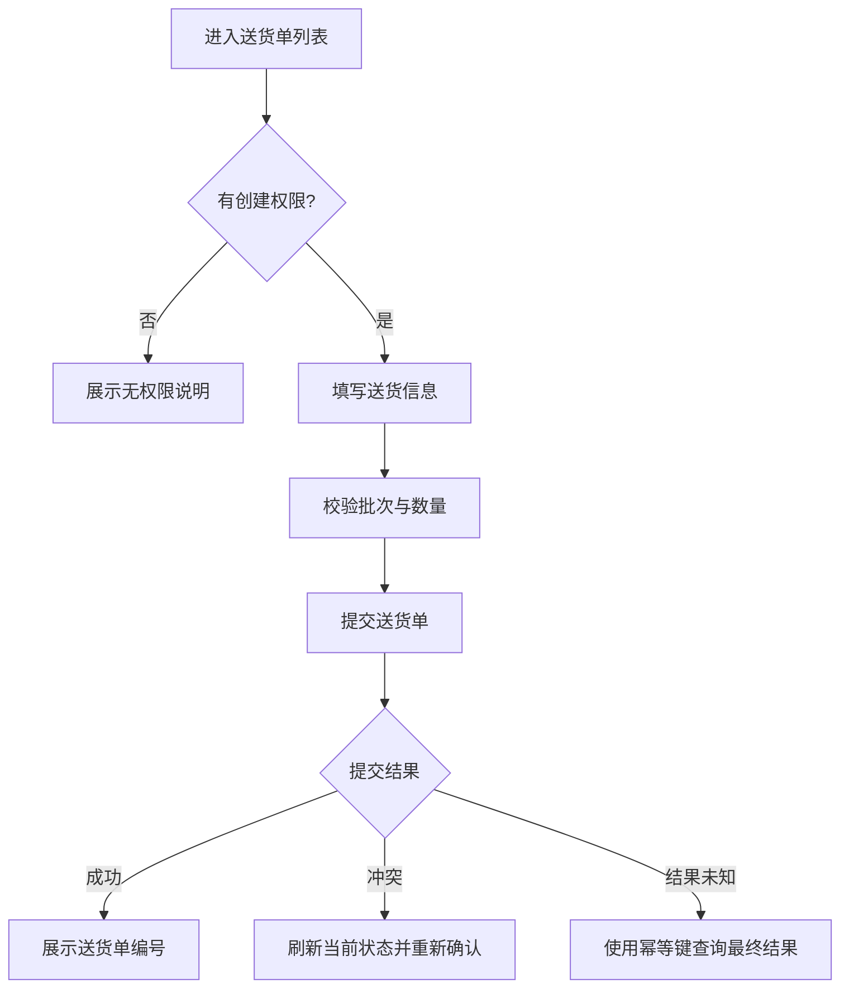

# 用户流程规范

## 1. 目的

用户流程描述某个角色如何从业务入口完成任务、作出决策、提交命令并处理异常。流程必须先于页面实现。

## 2. 存放方式

```text
docs/user-flows/<vertical-slice>/
├── README.md
├── 管理端流程.md
├── 供应商门户流程.md
└── 客户门户流程.md
```

一个切片没有某类用户时可以省略对应文件。

## 3. 最小表达

```text
角色
→ 入口
→ 前置条件
→ 查看信息
→ 决策
→ 提交命令
→ 服务端结果
→ 下一步
→ 异常与恢复
```

## 4. 流程内容

每个流程至少包含：

- 流程名称和目标。
- 关联需求编号。
- 用户角色。
- 数据范围。
- 入口页面。
- 前置条件。
- 主成功路径。
- 业务分支。
- 权限不足。
- 数据已变化。
- 网络失败和结果未知。
- 异步处理中。
- 失败恢复或人工接管。
- 完成结果。
- 关联页面、原型和 API 映射。

## 5. 推荐 Mermaid 表达



## 6. 用户流程与后端状态机

用户流程不能发明后端不存在的状态或命令。

必须确认：

- 当前状态允许哪些操作。
- 命令由哪个服务处理。
- 成功后进入什么状态。
- 异步任务如何查询。
- 失败是否可以重试。
- 人工接管需要什么权限。

## 7. 主流程与异常流程

不能只画成功路径。至少分析：

- 无权限。
- 无数据。
- 校验失败。
- 状态冲突。
- 重复提交。
- 请求超时。
- 后端依赖失败。
- 异步任务阻塞。
- 用户主动取消。
- 会话过期。

## 8. VS-01 流程范围

VS-01 包括：

- 供应商创建送货单。
- 来料检验。
- 原料收货和入库。
- 工单和物料预占。
- PCS 生产执行。
- 成品检验放行。
- WCS 自动入库。
- 客户发运。
- 正反向追溯和模拟召回。

## 9. 评审清单

- 用户目标是否明确。
- 角色和数据范围是否明确。
- 每个决策是否有信息依据。
- 页面是否支持下一步动作。
- 异常和恢复是否完整。
- 与后端状态机是否一致。
- 是否关联需求、原型和 API。
- 是否存在不必要的页面跳转。
